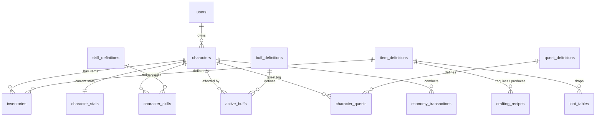

# Database Design: zzrpg PostgreSQL Schema

To achieve a fully **data-driven** design where new items, skills, buffs, quests, recipes, and loot rules require only database edits, we rely on a PostgreSQL schema combined with JSONB for dynamic properties.

---

## 1. Schema Diagram & Relationships



---

## 2. Table Definitions (DDL & Indexes)

### Users & Authentication
```sql
CREATE TABLE users (
    id SERIAL PRIMARY KEY,
    username VARCHAR(50) UNIQUE NOT NULL,
    email VARCHAR(100) UNIQUE NOT NULL,
    password_hash VARCHAR(255) NOT NULL,
    created_at TIMESTAMP WITH TIME ZONE DEFAULT CURRENT_TIMESTAMP,
    updated_at TIMESTAMP WITH TIME ZONE DEFAULT CURRENT_TIMESTAMP
);
CREATE INDEX idx_users_username ON users(username);
```

### Characters
```sql
CREATE TABLE characters (
    id SERIAL PRIMARY KEY,
    user_id INTEGER NOT NULL REFERENCES users(id) ON DELETE CASCADE,
    name VARCHAR(32) UNIQUE NOT NULL,
    class_name VARCHAR(20) NOT NULL, -- "WARRIOR", "MAGE", "ASSASSIN", "SURA"
    level INTEGER NOT NULL DEFAULT 1,
    experience BIGINT NOT NULL DEFAULT 0,
    gold BIGINT NOT NULL DEFAULT 0,
    last_active_at TIMESTAMP WITH TIME ZONE DEFAULT CURRENT_TIMESTAMP,
    created_at TIMESTAMP WITH TIME ZONE DEFAULT CURRENT_TIMESTAMP,
    updated_at TIMESTAMP WITH TIME ZONE DEFAULT CURRENT_TIMESTAMP
);
CREATE INDEX idx_characters_user_id ON characters(user_id);
```

### Character Stats (Dynamic & Calculated Cache)
Go backend loads the values here, sends the modifications to `zzstat`, and caches the calculated final stats.
```sql
CREATE TABLE character_stats (
    character_id INTEGER PRIMARY KEY REFERENCES characters(id) ON DELETE CASCADE,
    base_stats JSONB NOT NULL, -- e.g., {"STR": 10, "INT": 10, "DEX": 10, "CON": 10}
    derived_stats JSONB NOT NULL, -- Cache of final computed stats: {"HP": 500, "MP": 200, "ATTACK": 120, "DEFENSE": 50...}
    updated_at TIMESTAMP WITH TIME ZONE DEFAULT CURRENT_TIMESTAMP
);
```

### Item Definitions (Data-Driven Templates)
No code changes are needed when adding items. All logic is driven by this configuration.
```sql
CREATE TABLE item_definitions (
    id VARCHAR(50) PRIMARY KEY, -- e.g., "dragon_sword_0", "red_potion_1"
    name VARCHAR(100) NOT NULL,
    description TEXT,
    slot_type VARCHAR(20) NOT NULL, -- "WEAPON", "BODY_ARMOR", "HELMET", "SHIELD", "SHOES", "ACCESSORY", "NONE" (consumable/quest)
    min_level INTEGER DEFAULT 1,
    class_restrictions VARCHAR(20)[] DEFAULT '{}', -- e.g. '{"WARRIOR", "SURA"}'
    stats_modifiers JSONB NOT NULL DEFAULT '[]', 
    -- e.g., [{"stat": "ATTACK", "operation": "ADD", "value": 150}, {"stat": "CRIT_RATE", "operation": "MULTIPLY", "value": 0.05}]
    metadata JSONB NOT NULL DEFAULT '{}', -- Use for weight, item type specific settings (potions heal etc)
    created_at TIMESTAMP WITH TIME ZONE DEFAULT CURRENT_TIMESTAMP
);
```

### Inventory & Equipment
Instead of a separate equipment table, we store all items in the inventory with a `slot_index`. 
- Slots `0` to `99` correspond to standard bag slots.
- Slots `1000` to `1020` correspond to active equipment slots (WEAPON=1000, BODY_ARMOR=1001, HELMET=1002, etc.).
```sql
CREATE TABLE inventories (
    id BIGSERIAL PRIMARY KEY,
    character_id INTEGER NOT NULL REFERENCES characters(id) ON DELETE CASCADE,
    slot_index INTEGER NOT NULL, -- 0..99 for bag, 1000+ for equipped
    item_definition_id VARCHAR(50) NOT NULL REFERENCES item_definitions(id),
    quantity INTEGER NOT NULL DEFAULT 1,
    durability INTEGER NOT NULL DEFAULT 100,
    custom_modifiers JSONB NOT NULL DEFAULT '[]', -- Random bonus stats when the item drops (like 7th/8th bonus)
    created_at TIMESTAMP WITH TIME ZONE DEFAULT CURRENT_TIMESTAMP,
    updated_at TIMESTAMP WITH TIME ZONE DEFAULT CURRENT_TIMESTAMP,
    UNIQUE (character_id, slot_index)
);
CREATE INDEX idx_inventories_character ON inventories(character_id);
```

### Skill Definitions & Character Skills
```sql
CREATE TABLE skill_definitions (
    id VARCHAR(50) PRIMARY KEY, -- e.g. "aura_of_sword", "fireball"
    name VARCHAR(100) NOT NULL,
    description TEXT,
    max_level INTEGER NOT NULL DEFAULT 10,
    cooldown_ms INTEGER NOT NULL DEFAULT 0,
    mp_cost_per_level JSONB NOT NULL DEFAULT '[]', -- Array index represents level [0, 10, 15, 20...]
    stats_modifiers_per_level JSONB NOT NULL DEFAULT '[]', -- Modifiers for the player when passive, or active buff stats
    metadata JSONB NOT NULL DEFAULT '{}' -- e.g. {"damage_multiplier": [1.2, 1.4, 1.6...], "cast_range": 500}
);

CREATE TABLE character_skills (
    character_id INTEGER NOT NULL REFERENCES characters(id) ON DELETE CASCADE,
    skill_id VARCHAR(50) NOT NULL REFERENCES skill_definitions(id) ON DELETE CASCADE,
    level INTEGER NOT NULL DEFAULT 1,
    updated_at TIMESTAMP WITH TIME ZONE DEFAULT CURRENT_TIMESTAMP,
    PRIMARY KEY (character_id, skill_id)
);
```

### Buff Definitions & Active Buffs
```sql
CREATE TABLE buff_definitions (
    id VARCHAR(50) PRIMARY KEY, -- e.g. "blessing_of_dragon", "poison"
    name VARCHAR(100) NOT NULL,
    description TEXT,
    is_debuff BOOLEAN NOT NULL DEFAULT FALSE,
    stacking_rule VARCHAR(30) NOT NULL DEFAULT 'REFRESH', -- 'REFRESH', 'STACK_INTENSITY', 'IGNORE'
    stats_modifiers JSONB NOT NULL DEFAULT '[]', -- e.g. [{"stat": "DEFENSE", "operation": "ADD", "value": 50}]
    metadata JSONB NOT NULL DEFAULT '{}'
);

CREATE TABLE active_buffs (
    id BIGSERIAL PRIMARY KEY,
    character_id INTEGER NOT NULL REFERENCES characters(id) ON DELETE CASCADE,
    buff_definition_id VARCHAR(50) NOT NULL REFERENCES buff_definitions(id) ON DELETE CASCADE,
    started_at TIMESTAMP WITH TIME ZONE NOT NULL DEFAULT CURRENT_TIMESTAMP,
    ends_at TIMESTAMP WITH TIME ZONE NOT NULL,
    source_character_id INTEGER REFERENCES characters(id) ON DELETE SET NULL
);
CREATE INDEX idx_active_buffs_character ON active_buffs(character_id);
CREATE INDEX idx_active_buffs_ends_at ON active_buffs(ends_at);
```

### Quests
```sql
CREATE TABLE quest_definitions (
    id VARCHAR(50) PRIMARY KEY, -- e.g., "kill_wolves_1"
    title VARCHAR(100) NOT NULL,
    description TEXT,
    min_level INTEGER DEFAULT 1,
    steps JSONB NOT NULL, -- e.g., [{"type": "KILL_MOB", "target": "wolf", "count": 10}, {"type": "TALK_NPC", "target": "blacksmith"}]
    rewards JSONB NOT NULL DEFAULT '{}', -- e.g. {"gold": 1000, "experience": 5000, "items": [{"id": "red_potion_1", "qty": 10}]}
    metadata JSONB NOT NULL DEFAULT '{}'
);

CREATE TABLE character_quests (
    character_id INTEGER NOT NULL REFERENCES characters(id) ON DELETE CASCADE,
    quest_id VARCHAR(50) NOT NULL REFERENCES quest_definitions(id) ON DELETE CASCADE,
    status VARCHAR(20) NOT NULL DEFAULT 'ACTIVE', -- 'ACTIVE', 'COMPLETED'
    current_step_index INTEGER NOT NULL DEFAULT 0,
    progress JSONB NOT NULL DEFAULT '[]', -- Array matching steps, tracking progress: [3, 0] (e.g. killed 3 wolves)
    updated_at TIMESTAMP WITH TIME ZONE DEFAULT CURRENT_TIMESTAMP,
    PRIMARY KEY (character_id, quest_id)
);
```

### Loot Tables & Crafting Recipes
```sql
CREATE TABLE loot_tables (
    id VARCHAR(50) PRIMARY KEY, -- e.g. "mob_wild_dog_drops", "metin_stone_level_5"
    description TEXT,
    entries JSONB NOT NULL DEFAULT '[]'
    -- e.g. [{"item_definition_id": "sword_0", "rate": 500, "min": 1, "max": 1}, {"item_definition_id": "gold", "rate": 8000, "min": 10, "max": 50}]
    -- rates are measured out of 10000 (e.g. 500 = 5%)
);

CREATE TABLE crafting_recipes (
    id VARCHAR(50) PRIMARY KEY, -- e.g. "craft_dragon_armor"
    result_item_id VARCHAR(50) NOT NULL REFERENCES item_definitions(id),
    result_qty INTEGER NOT NULL DEFAULT 1,
    success_rate INTEGER NOT NULL DEFAULT 10000, -- out of 10000 (e.g. 8000 = 80%)
    cost_gold BIGINT NOT NULL DEFAULT 0,
    required_ingredients JSONB NOT NULL DEFAULT '[]' -- e.g. [{"item_id": "iron_ore", "qty": 5}, {"item_id": "magic_dust", "qty": 1}]
);
```

### Economy Transactions
```sql
CREATE TABLE economy_transactions (
    id BIGSERIAL PRIMARY KEY,
    sender_character_id INTEGER REFERENCES characters(id) ON DELETE SET NULL,
    receiver_character_id INTEGER REFERENCES characters(id) ON DELETE SET NULL,
    amount BIGINT NOT NULL,
    currency VARCHAR(20) NOT NULL DEFAULT 'GOLD',
    transaction_type VARCHAR(30) NOT NULL, -- 'TRADE', 'NPC_BUY', 'NPC_SELL', 'QUEST_REWARD', 'MONSTER_DROP', 'UPGRADE_COST'
    created_at TIMESTAMP WITH TIME ZONE DEFAULT CURRENT_TIMESTAMP
);
CREATE INDEX idx_transactions_sender ON economy_transactions(sender_character_id);
CREATE INDEX idx_transactions_receiver ON economy_transactions(receiver_character_id);
```

---

## 3. JSONB Structures and Indexes

To keep data retrieval efficient while matching the dynamic modifiers structure, we add **GIN Indexes** on the fields inside JSONB.

For example, selecting items that modify specific stats:
```sql
CREATE INDEX idx_items_modifiers ON item_definitions USING gin (stats_modifiers);
```
This enables querying items that modify `CRIT_RATE` using PG jsonb contains query (`@>`):
```sql
SELECT id FROM item_definitions WHERE stats_modifiers @> '[{"stat": "CRIT_RATE"}]';
```
Similarly for player quests:
```sql
CREATE INDEX idx_character_quests_progress ON character_quests USING gin (progress);
```
