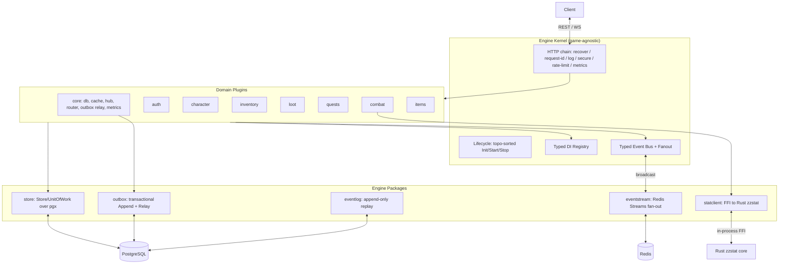

# Architecture Document: zzrpg Engine (EN)

`zzrpg` is a **plugin-first, event-driven, data-driven backend engine** for idle
online RPGs. A game-agnostic **kernel** owns the lifecycle and infrastructure;
game domains are **plugins**; rules and content are **data**; domains communicate
through a **typed event bus** that fans out across nodes.

## 1. System Architecture

The Go backend is **not** a monolith of hardwired modules: a kernel wires domains
declaratively, so a domain can be added, removed, or reordered without editing the
core, and stat/combat math is offloaded to an embedded Rust core via in-process
FFI (no network hop).

---

## 2. Layers

### 2.1 Engine kernel (`backend/engine/kernel`)
Owns config, logger, the DI registry, the event bus, the HTTP mux + middleware
chain, and Prometheus metrics. `Run` topologically sorts plugins by their declared
`Requires`, calls `Init` then `Start` in order, serves HTTP until cancellation,
then `Stop`s in reverse. Zero RPG concepts.

### 2.2 Plugin contract (`backend/engine/plugin`)
A plugin declares `Meta{Name, Requires}` and implements `Init/Start/Stop`. `Init`
receives an `InitContext` (registry, bus, mux, config, logger, context); `Start`
receives a `RunContext`. Plugins **provide** services into the registry and
**resolve** the ones they depend on — dependencies are declared, not set by hand.
This resolves cycles (e.g. character ↔ inventory) via ordering.

### 2.3 Typed registry, bus & fan-out (`engine/registry`, `engine/bus`, `engine/eventstream`)
- **Registry** — typed generic `Provide[T]/Resolve[T]`.
- **Bus** — typed `Event`/`Handler`/`Subscribe`/`Publish`; async, panic-isolated.
  Wrapped in a **Fanout** decorator: `Publish` delivers locally and, when a
  forwarder is installed, broadcasts to other nodes; `PublishLocal` re-injects
  remote events without re-forwarding (no cluster loop).
- **eventstream** — a Redis-Streams `Publisher` + per-node `Consumer` (broadcast
  fan-out, origin de-dup). Absent Redis, the app runs single-node unchanged.

### 2.4 Persistence (`engine/store`)
A `Querier` (Query/QueryRow/Exec — satisfied by both `*pgxpool.Pool` and `pgx.Tx`)
plus a `Store` with `WithinTx(fn)`. Repositories depend on `store.Store`, so a
method runs standalone or inside a transaction. Migrations are embedded SQL, run
automatically at startup, and are idempotent.

### 2.5 Durable events (`engine/outbox`, `engine/eventlog`)
- **Outbox** — `Append(ctx, Querier, event)` writes an event in the *same
  transaction* as the state change; a `Relay` polls undispatched rows, decodes
  them via a shared registry, publishes on the bus (at-least-once), and prunes old
  dispatched rows.
- **event_log** — append-only per-stream history; `Replay(stream, since)` powers
  reconnect catch-up (e.g. `AWAY_EVENTS` on login).

### 2.6 Data-driven content (`backend/content`)
Embedded JSON packs: class base stats, derived-stat coefficients, mob definitions,
the combat damage formula (a `zzstat` AST), idle/offline economy, and loot fallback
tables. The `statclient` feeds these to the Rust core rather than hardcoding math.

---

## 3. Domains (plugins, `backend/internal`)

`auth`, `character`, `inventory`, `items`, `loot`, `quests`, `combat`,
`killreward`, `session`, `socket`, `statclient`, `database`. Each is self-contained
(repository + service + transport). Cross-domain calls go through **consumer-owned
minimal interfaces** (a consumer declares just the surface it needs, e.g.
`combat.CharacterReader`), and reactions go through the event bus, so producers
don't depend on their consumers.

---

## 4. Technology Stack

- **Go** — kernel, plugins, concurrency, HTTP/WS gateway.
- **PostgreSQL 16+** (`pgx`) — persistence behind the `store` seam; JSONB for
  data-driven fields; outbox / event_log / refresh_tokens tables.
- **Redis 7+** — read-through cache and the cross-node event stream (optional;
  graceful degradation to single-node).
- **Rust `zzstat`** — stat/combat formula core compiled to `libzzstat_ffi.so`,
  embedded via `purego` FFI (no network overhead).
- **Observability & hardening** — Prometheus `/metrics`, `/readyz`, request-id,
  per-IP rate limiting, security headers, login brute-force guard, rotating
  refresh tokens.

See [`ENGINE_TRANSFORMATION_PLAN.md`](ENGINE_TRANSFORMATION_PLAN.md) for the full
design, rationale, and roadmap (including the planned hook/filter system and
runtime plugin boundary for third-party extensions).
