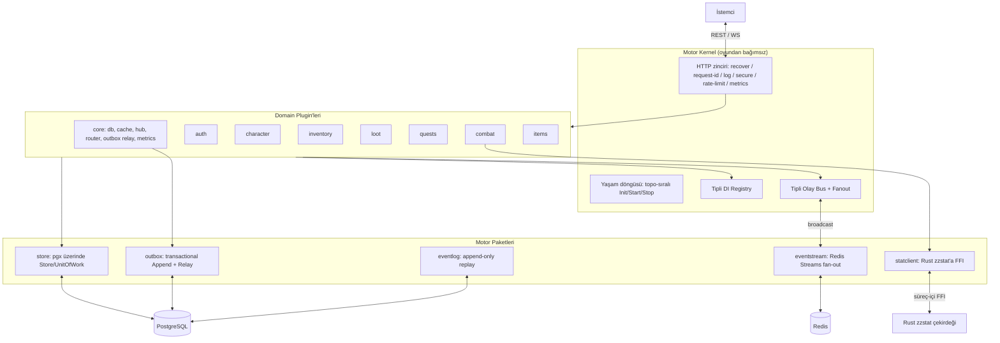

# Mimari Dokümanı: zzrpg Motoru (TR)

`zzrpg`, idle online RPG'ler için **plugin-öncelikli, olay-güdümlü, veri-güdümlü
bir backend motorudur**. Oyundan bağımsız bir **kernel** yaşam döngüsünü ve
altyapıyı sahiplenir; oyun alanları (domain) birer **plugin**'dir; kurallar ve
içerik **veridir**; alanlar node'lar arasına yayılan **tipli bir olay bus'ı**
üzerinden haberleşir.

## 1. Sistem Mimarisi

Go backend, sabit-bağlı modüllerden oluşan bir monolit **değildir**: kernel
alanları deklaratif olarak bağlar; bir alan, core'a dokunmadan eklenebilir,
çıkarılabilir veya yeniden sıralanabilir. Stat/combat matematiği ise süreç-içi FFI
ile gömülü Rust çekirdeğine devredilir (ağ atlaması yok).

---

## 2. Katmanlar

### 2.1 Motor kernel (`backend/engine/kernel`)
Config, logger, DI registry, olay bus'ı, HTTP mux + middleware zinciri ve
Prometheus metriklerini sahiplenir. `Run`, plugin'leri deklare ettikleri
`Requires`'a göre topolojik sıralar; sırayla `Init` sonra `Start` çağırır; iptal
olana dek HTTP sunar; sonra ters sırayla `Stop` eder. Sıfır RPG kavramı içerir.

### 2.2 Plugin sözleşmesi (`backend/engine/plugin`)
Bir plugin `Meta{Name, Requires}` deklare eder ve `Init/Start/Stop` uygular. `Init`
bir `InitContext` alır (registry, bus, mux, config, logger, context); `Start` bir
`RunContext` alır. Plugin'ler servisleri registry'ye **provide** eder ve bağımlı
olduklarını **resolve** eder — bağımlılıklar elle set edilmez, deklare edilir. Bu,
döngüleri (ör. character ↔ inventory) sıralamayla çözer.

### 2.3 Tipli registry, bus & fan-out
- **Registry** — tipli generic `Provide[T]/Resolve[T]`.
- **Bus** — tipli `Event`/`Handler`/`Subscribe`/`Publish`; async, panik-izole. Bir
  **Fanout** decorator'ıyla sarılıdır: `Publish` yerelde dağıtır ve bir forwarder
  kuruluysa diğer node'lara yayınlar; `PublishLocal` uzak olayları yeniden-forward
  etmeden enjekte eder (cluster döngüsü yok).
- **eventstream** — Redis-Streams `Publisher` + node başına `Consumer` (broadcast
  fan-out, origin de-dup). Redis yoksa uygulama tek-node çalışır.

### 2.4 Kalıcılık (`engine/store`)
`Querier` (Query/QueryRow/Exec — hem `*pgxpool.Pool` hem `pgx.Tx` karşılar) artı
`WithinTx(fn)` içeren bir `Store`. Repository'ler `store.Store`'a bağlıdır; bir
metot tek başına ya da bir transaction içinde çalışır. Migration'lar gömülü SQL'dir,
başlangıçta otomatik çalışır ve idempotenttir.

### 2.5 Dayanıklı olaylar (`engine/outbox`, `engine/eventlog`)
- **Outbox** — `Append(ctx, Querier, event)` olayı state değişikliğiyle *aynı
  transaction'da* yazar; bir `Relay` dispatch edilmemiş satırları poll eder,
  paylaşılan registry ile decode edip bus'a yayınlar (at-least-once) ve eski
  dispatch edilmiş satırları budar.
- **event_log** — append-only, stream başına geçmiş; `Replay(stream, since)`
  yeniden-bağlanma yakalamasını besler (girişte `AWAY_EVENTS`).

### 2.6 Veri-güdümlü içerik (`backend/content`)
Gömülü JSON pack'ler: class temel statları, derived-stat katsayıları, mob
tanımları, combat hasar formülü (`zzstat` AST'si), idle/offline ekonomi ve loot
fallback tabloları. `statclient` bunları Rust çekirdeğine besler, matematiği
gömmez.

---

## 3. Domain'ler (plugin'ler, `backend/internal`)

`auth`, `character`, `inventory`, `items`, `loot`, `quests`, `combat`,
`killreward`, `session`, `socket`, `statclient`, `database`. Her biri kendi
içinde bütündür (repository + service + transport). Alanlar-arası çağrılar
**tüketici-sahipli minimal arayüzlerden** geçer (tüketici yalnızca ihtiyaç
duyduğu yüzeyi deklare eder, ör. `combat.CharacterReader`); tepkiler olay bus'ından
geçer, böylece üreticiler tüketicilerine bağımlı olmaz.

---

## 4. Teknoloji Yığını

- **Go** — kernel, plugin'ler, eşzamanlılık, HTTP/WS gateway.
- **PostgreSQL 16+** (`pgx`) — `store` seam'i arkasında kalıcılık; veri-güdümlü
  alanlar için JSONB; outbox / event_log / refresh_tokens tabloları.
- **Redis 7+** — read-through cache ve node'lar-arası olay stream'i (opsiyonel;
  tek-node'a graceful degradation).
- **Rust `zzstat`** — `libzzstat_ffi.so`'ya derlenen stat/combat formül çekirdeği,
  `purego` FFI ile gömülü (ağ maliyeti yok).
- **Gözlemlenebilirlik & sertleştirme** — Prometheus `/metrics`, `/readyz`,
  request-id, IP-başı rate limit, güvenlik başlıkları, login brute-force koruması,
  rotating refresh token'lar.

Tam tasarım, gerekçe ve yol haritası (planlanan hook/filter sistemi ve üçüncü-parti
eklentiler için runtime plugin sınırı dahil) için bkz.
[`ENGINE_TRANSFORMATION_PLAN.md`](ENGINE_TRANSFORMATION_PLAN.md).
