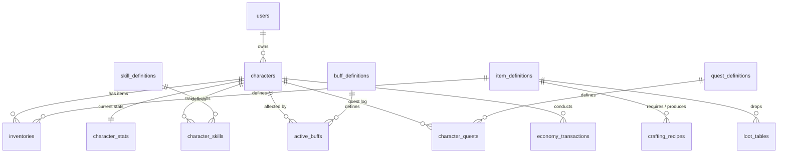

# Database Design: zzrpg PostgreSQL Schema (EN)

To achieve a fully **data-driven** design where new items, skills, buffs, quests, recipes, and loot rules require only database edits, we rely on a PostgreSQL schema combined with JSONB for dynamic properties.

---

## 1. Schema Diagram & Relationships



---

## 2. Dynamic Modifier Schema (JSONB)

Items and skills use a unified modifier structure under the `stats` or `effects` JSONB columns to apply bonuses to characters.

### 2.1 Modifier Structure
Each modifier object has the following fields:
```json
{
  "stat": "ATTACK",       // Target attribute
  "operation": "ADD",     // "ADD" (flat) or "MULTIPLY" (percentage)
  "value": 15.0,          // Quantity of modification
  "priority": 20,         // Order of calculation (lower priorities run first)
  "source_id": "sword_01" // Source tracker for resolving stacking rules
}
```

---

## 3. Core Table Definitions

### 3.1 `users`
Accounts credentials and session information.
```sql
CREATE TABLE users (
    id SERIAL PRIMARY KEY,
    username VARCHAR(50) UNIQUE NOT NULL,
    email VARCHAR(100) UNIQUE NOT NULL,
    password_hash VARCHAR(255) NOT NULL,
    created_at TIMESTAMP WITH TIME ZONE DEFAULT CURRENT_TIMESTAMP,
    updated_at TIMESTAMP WITH TIME ZONE DEFAULT CURRENT_TIMESTAMP
);
```

### 3.2 `characters`
Core metadata for the player's characters.
```sql
CREATE TABLE characters (
    id SERIAL PRIMARY KEY,
    user_id INTEGER REFERENCES users(id) ON DELETE CASCADE,
    name VARCHAR(50) UNIQUE NOT NULL,
    class_name VARCHAR(20) NOT NULL, -- "WARRIOR", "MAGE", "ROGUE", "CLERIC"
    level INTEGER DEFAULT 1,
    experience INTEGER DEFAULT 0,
    gold INTEGER DEFAULT 0,
    last_active_at TIMESTAMP WITH TIME ZONE DEFAULT CURRENT_TIMESTAMP,
    created_at TIMESTAMP WITH TIME ZONE DEFAULT CURRENT_TIMESTAMP,
    updated_at TIMESTAMP WITH TIME ZONE DEFAULT CURRENT_TIMESTAMP
);
```

### 3.3 `character_stats`
Caches the player's base and derived stats (precalculated via the `zzstat` engine).
```sql
CREATE TABLE character_stats (
    character_id INTEGER PRIMARY KEY REFERENCES characters(id) ON DELETE CASCADE,
    base_stats JSONB NOT NULL,    -- {"STR": 15, "CON": 15, "INT": 5, "DEX": 10}
    derived_stats JSONB NOT NULL, -- {"HP": 225, "MP": 50, "ATTACK": 30, "DEFENSE": 15, "CRIT_RATE": 5}
    updated_at TIMESTAMP WITH TIME ZONE DEFAULT CURRENT_TIMESTAMP
);
```

### 3.4 `item_definitions`
Data-driven catalog of all item specifications.
```sql
CREATE TABLE item_definitions (
    id VARCHAR(50) PRIMARY KEY,
    name VARCHAR(100) NOT NULL,
    item_type VARCHAR(20) NOT NULL,   -- "WEAPON", "ARMOR", "POTION", "MATERIAL"
    slot_type VARCHAR(20) NOT NULL,   -- "WEAPON", "ARMOR", "BAG"
    min_level INTEGER DEFAULT 1,
    class_restriction VARCHAR(20),    -- NULL means all classes can equip
    base_durability INTEGER DEFAULT 100,
    stats JSONB DEFAULT '[]'::jsonb,  -- Array of Modifier objects
    created_at TIMESTAMP WITH TIME ZONE DEFAULT CURRENT_TIMESTAMP
);
```

### 3.5 `inventories`
Grid-based player bag storage and equipped slots.
- Bag slots range from `0` to `99`.
- Equipment slots range from `1000` to `1005` (e.g. 1000 = Weapon, 1001 = Shield, 1002 = Armor).
```sql
CREATE TABLE inventories (
    id SERIAL PRIMARY KEY,
    character_id INTEGER REFERENCES characters(id) ON DELETE CASCADE,
    item_definition_id VARCHAR(50) REFERENCES item_definitions(id) ON DELETE RESTRICT,
    slot_index INTEGER NOT NULL, -- 0..99 (bag), 1000..1005 (equipped)
    quantity INTEGER DEFAULT 1,
    current_durability INTEGER,
    created_at TIMESTAMP WITH TIME ZONE DEFAULT CURRENT_TIMESTAMP,
    updated_at TIMESTAMP WITH TIME ZONE DEFAULT CURRENT_TIMESTAMP,
    UNIQUE (character_id, slot_index)
);
```

### 3.6 `quest_definitions`
Data-driven quest tasks and progression rules.
```sql
CREATE TABLE quest_definitions (
    id VARCHAR(50) PRIMARY KEY,
    title VARCHAR(150) NOT NULL,
    description TEXT,
    min_level INTEGER DEFAULT 1,
    requirements JSONB NOT NULL, -- [{"type": "KILL_MOB", "target": "training_dummy", "amount": 5}]
    rewards JSONB NOT NULL,      -- {"gold": 100, "experience": 500, "items": [{"id": "potion_hp", "qty": 3}]}
    created_at TIMESTAMP WITH TIME ZONE DEFAULT CURRENT_TIMESTAMP
);
```

### 3.7 `character_quests`
Quest progress logs for characters.
```sql
CREATE TABLE character_quests (
    id SERIAL PRIMARY KEY,
    character_id INTEGER REFERENCES characters(id) ON DELETE CASCADE,
    quest_definition_id VARCHAR(50) REFERENCES quest_definitions(id) ON DELETE CASCADE,
    progress JSONB NOT NULL, -- [{"type": "KILL_MOB", "target": "training_dummy", "current": 2, "required": 5}]
    status VARCHAR(20) DEFAULT 'ACTIVE', -- "ACTIVE", "COMPLETED"
    created_at TIMESTAMP WITH TIME ZONE DEFAULT CURRENT_TIMESTAMP,
    updated_at TIMESTAMP WITH TIME ZONE DEFAULT CURRENT_TIMESTAMP,
    UNIQUE (character_id, quest_definition_id)
);
```

### 3.8 `loot_tables`
Data-driven probability matrix for drop generation.
```sql
CREATE TABLE loot_tables (
    id VARCHAR(50) PRIMARY KEY,
    description VARCHAR(255),
    entries JSONB NOT NULL, -- [{"item_definition_id": "gold", "rate": 5000, "min": 10, "max": 50}] (Rate out of 10000)
    created_at TIMESTAMP WITH TIME ZONE DEFAULT CURRENT_TIMESTAMP
);
```
