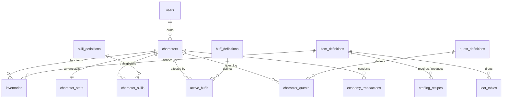

# Veritabanı Tasarımı: zzrpg PostgreSQL Şeması (TR)

Yeni eşyaların, yeteneklerin, buff'ların, görevlerin, tariflerin ve ganimet kurallarının kod değişikliği gerektirmeden sadece veritabanı düzenlemeleriyle yapılabilmesi için PostgreSQL şeması ve dinamik özellikler için JSONB sütunları bir arada kullanılmıştır.

> **Motor güncellemesi.** Migration'lar gömülü SQL'dir, **başlangıçta otomatik**
> çalışır (idempotent) ve `schema_migrations`'ta izlenir. Oyun tablolarının
> ötesinde motor şunları ekler:
>
> - `outbox` — transactional outbox; domain olayları state değişikliğiyle aynı
>   tx'te yazılır, commit sonrası dağıtılır, sonra budanır (`published_at`).
> - `event_log` — replay için append-only, stream-başına olay geçmişi
>   (`stream`, `event_type`, `payload`, `occurred_at`).
> - `refresh_tokens` — rotating, iptal-edilebilir refresh token'lar (yalnızca
>   SHA-256 hash, `expires_at`, `users`'a FK, `ON DELETE CASCADE`).
>
> Repository'ler bunlara ham `*pgxpool.Pool` yerine `store.Store`/`Querier` seam'i
> üzerinden erişir (bir metot tek başına ya da `WithinTx` içinde çalışır).

---

## 1. Şema Diyagramı ve İlişkiler



---

## 2. Dinamik Modifikatör Şeması (JSONB)

Eşyalar ve yetenekler, karakterlere bonus uygulamak için `stats` veya `effects` JSONB sütunları altında birleşik bir modifikatör yapısı kullanır.

### 2.1 Modifikatör Yapısı
Her modifikatör nesnesi şu alanlara sahiptir:
```json
{
  "stat": "ATTACK",       // Hedef nitelik/istatistik
  "operation": "ADD",     // "ADD" (düz ekleme) veya "MULTIPLY" (yüzdesel çarpan)
  "value": 15.0,          // Modifikasyon miktarı
  "priority": 20,         // Hesaplama sırası (düşük öncelikler önce çalışır)
  "source_id": "sword_01" // İstifleme kurallarını çözmek için kaynak izleyici
}
```

---

## 3. Temel Tablo Tanımları

### 3.1 `users`
Kullanıcı hesap bilgileri ve oturum verileri.
```sql
CREATE TABLE users (
    id SERIAL PRIMARY KEY,
    username VARCHAR(50) UNIQUE NOT NULL,
    email VARCHAR(100) UNIQUE NOT NULL,
    password_hash VARCHAR(255) NOT NULL,
    created_at TIMESTAMP WITH TIME ZONE DEFAULT CURRENT_TIMESTAMP,
    updated_at TIMESTAMP WITH TIME ZONE DEFAULT CURRENT_TIMESTAMP
);
```

### 3.2 `characters`
Oyuncu karakterlerinin temel metadataları.
```sql
CREATE TABLE characters (
    id SERIAL PRIMARY KEY,
    user_id INTEGER REFERENCES users(id) ON DELETE CASCADE,
    name VARCHAR(50) UNIQUE NOT NULL,
    class_name VARCHAR(20) NOT NULL, -- "WARRIOR", "MAGE", "ROGUE", "CLERIC"
    level INTEGER DEFAULT 1,
    experience INTEGER DEFAULT 0,
    gold INTEGER DEFAULT 0,
    last_active_at TIMESTAMP WITH TIME ZONE DEFAULT CURRENT_TIMESTAMP,
    created_at TIMESTAMP WITH TIME ZONE DEFAULT CURRENT_TIMESTAMP,
    updated_at TIMESTAMP WITH TIME ZONE DEFAULT CURRENT_TIMESTAMP
);
```

### 3.3 `character_stats`
Karakterlerin temel ve türetilmiş statülerini önbelleğe alır (`zzstat` motoru üzerinden süreç-içi olarak hesaplanır).
```sql
CREATE TABLE character_stats (
    character_id INTEGER PRIMARY KEY REFERENCES characters(id) ON DELETE CASCADE,
    base_stats JSONB NOT NULL,    -- {"STR": 15, "CON": 15, "INT": 5, "DEX": 10}
    derived_stats JSONB NOT NULL, -- {"HP": 225, "MP": 50, "ATTACK": 30, "DEFENSE": 15, "CRIT_RATE": 5}
    updated_at TIMESTAMP WITH TIME ZONE DEFAULT CURRENT_TIMESTAMP
);
```

### 3.4 `item_definitions`
Tüm eşya özelliklerinin veri-odaklı kataloğu.
```sql
CREATE TABLE item_definitions (
    id VARCHAR(50) PRIMARY KEY,
    name VARCHAR(100) NOT NULL,
    item_type VARCHAR(20) NOT NULL,   -- "WEAPON", "ARMOR", "POTION", "MATERIAL"
    slot_type VARCHAR(20) NOT NULL,   -- "WEAPON", "ARMOR", "BAG"
    min_level INTEGER DEFAULT 1,
    class_restriction VARCHAR(20),    -- NULL ise tüm sınıflar kuşanabilir
    base_durability INTEGER DEFAULT 100,
    stats JSONB DEFAULT '[]'::jsonb,  -- Modifikatör nesnelerinin dizisi
    created_at TIMESTAMP WITH TIME ZONE DEFAULT CURRENT_TIMESTAMP
);
```

### 3.5 `inventories`
Karakterlerin çanta envanterleri (grid-based) ve kuşanılmış aktif ekipman yuvaları.
- Çanta yuvaları (bag slots) `0` ile `99` arasındadır.
- Ekipman yuvaları (equipment slots) `1000` ile `1005` arasındadır (Örn: 1000 = Weapon, 1001 = Shield, 1002 = Armor).
```sql
CREATE TABLE inventories (
    id SERIAL PRIMARY KEY,
    character_id INTEGER REFERENCES characters(id) ON DELETE CASCADE,
    item_definition_id VARCHAR(50) REFERENCES item_definitions(id) ON DELETE RESTRICT,
    slot_index INTEGER NOT NULL, -- 0..99 (çanta), 1000..1005 (kuşanılmış)
    quantity INTEGER DEFAULT 1,
    current_durability INTEGER,
    created_at TIMESTAMP WITH TIME ZONE DEFAULT CURRENT_TIMESTAMP,
    updated_at TIMESTAMP WITH TIME ZONE DEFAULT CURRENT_TIMESTAMP,
    UNIQUE (character_id, slot_index)
);
```

### 3.6 `quest_definitions`
Veri-odaklı görev hedefleri ve ilerleme kuralları.
```sql
CREATE TABLE quest_definitions (
    id VARCHAR(50) PRIMARY KEY,
    title VARCHAR(150) NOT NULL,
    description TEXT,
    min_level INTEGER DEFAULT 1,
    requirements JSONB NOT NULL, -- [{"type": "KILL_MOB", "target": "training_dummy", "amount": 5}]
    rewards JSONB NOT NULL,      -- {"gold": 100, "experience": 500, "items": [{"id": "potion_hp", "qty": 3}]}
    created_at TIMESTAMP WITH TIME ZONE DEFAULT CURRENT_TIMESTAMP
);
```

### 3.7 `character_quests`
Karakterlerin görev ilerleme günlükleri.
```sql
CREATE TABLE character_quests (
    id SERIAL PRIMARY KEY,
    character_id INTEGER REFERENCES characters(id) ON DELETE CASCADE,
    quest_definition_id VARCHAR(50) REFERENCES quest_definitions(id) ON DELETE CASCADE,
    progress JSONB NOT NULL, -- [{"type": "KILL_MOB", "target": "training_dummy", "current": 2, "required": 5}]
    status VARCHAR(20) DEFAULT 'ACTIVE', -- "ACTIVE", "COMPLETED"
    created_at TIMESTAMP WITH TIME ZONE DEFAULT CURRENT_TIMESTAMP,
    updated_at TIMESTAMP WITH TIME ZONE DEFAULT CURRENT_TIMESTAMP,
    UNIQUE (character_id, quest_definition_id)
);
```

### 3.8 `loot_tables`
Düşecek ganimet üretimleri için veri-odaklı olasılık matrisi.
```sql
CREATE TABLE loot_tables (
    id VARCHAR(50) PRIMARY KEY,
    description VARCHAR(255),
    entries JSONB NOT NULL, -- [{"item_definition_id": "gold", "rate": 5000, "min": 10, "max": 50}] (10.000 üzerinden oran)
    created_at TIMESTAMP WITH TIME ZONE DEFAULT CURRENT_TIMESTAMP
);
```
