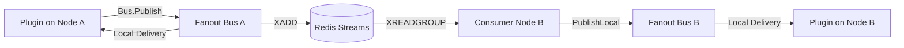

<!-- sha: 9c3c8fe0620049fbc5e5d6ad4f7097d514b7124e -->
# 🏛️ Core Architecture & Kernel Substrate

The `zzrpg` engine kernel is a **domain-agnostic, plugin-first backend substrate**. It contains zero RPG concepts (no "character", "quest", "mob", or "gold") and serves as the execution lifecycle container for game plugins.

## 0. Four-Layer Repository Structure

The codebase is split into four layers with a strict dependency direction (each layer may depend only on layers above it):

| Layer | Path | Contents | Imports domains? |
|---|---|---|---|
| **Engine** | `backend/engine/` | Game-agnostic core: kernel, DI registry, event `bus`, `hooks`, `outbox`, and the `admin` presentation/activation contract | No |
| **Platform** | `backend/platform/` | Domain-free infrastructure: `socket` (WebSocket transport), `session`, `statclient` (Rust FFI), `database` | No |
| **Game** | `backend/game/` | The sample RPG's domains: `auth`, `character`, `combat`, `creature`, `idle`, `inventory`, `items`, `killreward`, `loot`, `quests`, `skills` | — |
| **Plugins** | `backend/plugins/` | Composition adapters that wire game + platform into the engine's plugin lifecycle | resolves via registry |

Domain logic deliberately no longer lives under `internal/`, so the engine and platform layers can be reused to build a different game by swapping out `game/` and `plugins/`. The transport (`platform/socket`) imports **zero** domain packages — authentication is injected via an `Authenticator`, and disconnects are surfaced through a `SetLogoutHandler` callback rather than the hub publishing a domain event.

## 1. Engine Kernel Components

The kernel ([backend/engine/kernel/kernel.go](file:///home/singo/github.com/singoesdeep/zzrpg/backend/engine/kernel/kernel.go#L25-L57)) manages:

- **Topological Lifecycle (`Init` -> `Start` -> `Stop`):**
  Plugins declare dependencies via `Meta().Requires`. The kernel sorts plugins topologically and initializes them in strict order, avoiding hand-wired construction cycles.
- **Typed Dependency Injection Registry (`registry`):**
  Provides type-safe `Provide[T]` and `Resolve[T]` semantics ([backend/engine/registry/registry.go](file:///home/singo/github.com/singoesdeep/zzrpg/backend/engine/registry/registry.go#L1-L40)).
- **Typed Event Bus & Fanout (`bus`):**
  In-proc event bus wrapped in a `Fanout` decorator to broadcast domain events asynchronously across cluster nodes via Redis Streams ([backend/engine/bus/fanout.go](file:///home/singo/github.com/singoesdeep/zzrpg/backend/engine/bus/fanout.go#L1-L45)).
- **Synchronous Hook Pipeline (`hooks`):**
  Panic-isolated, priority-ordered hook pipeline supporting **Filters** (data mutation) and **Actions** (veto gates) ([backend/engine/hooks/hooks.go](file:///home/singo/github.com/singoesdeep/zzrpg/backend/engine/hooks/hooks.go#L1-L50)).

## 2. Cluster Event Fan-Out

When Redis is enabled, `eventstream` ([backend/engine/eventstream/eventstream.go](file:///home/singo/github.com/singoesdeep/zzrpg/backend/engine/eventstream/eventstream.go#L1-L60)) hooks into the `Fanout` bus. Local events published on node A are serialized into Redis Streams and dispatched to node B with origin de-duplication.

## 3. Grounding & Code References

- Kernel Struct & Lifecycle: [kernel.go:L25-L150](file:///home/singo/github.com/singoesdeep/zzrpg/backend/engine/kernel/kernel.go#L25-L150)
- Event Bus Interface: [bus.go:L1-L35](file:///home/singo/github.com/singoesdeep/zzrpg/backend/engine/bus/bus.go#L1-L35)
- Hook Pipeline: [hooks.go:L1-L70](file:///home/singo/github.com/singoesdeep/zzrpg/backend/engine/hooks/hooks.go#L1-L70)
