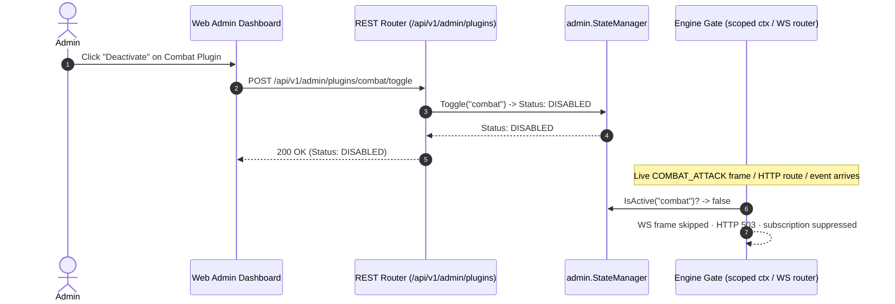

<!-- sha: 9c3c8fe0620049fbc5e5d6ad4f7097d514b7124e -->
# 🧩 Plugin Subsystem & Extensibility

`zzrpg` follows a WordPress-style modular plugin architecture in Go. Plugins are thin **composition adapters** under `backend/plugins/`: each wires a game domain (from `backend/game/`) to shared infrastructure (`backend/platform/`) and the engine (`backend/engine/`). Domain logic lives in `backend/game/<domain>/`; the plugin only assembles it. See [Architecture](architecture.md) for the four-layer structure.

## 1. Plugin Interface Contract

Every plugin implements `plugin.Plugin` ([backend/engine/plugin/plugin.go](file:///home/singo/github.com/singoesdeep/zzrpg/backend/engine/plugin/plugin.go#L28-L40)):

```go
type Plugin interface {
    Meta() Meta                 // Name & Requires dependencies
    Init(InitContext) error     // Services, routes, events, & hooks
    Start(RunContext) error     // Background goroutines (optional)
    Stop(context.Context) error // Teardown (optional)
}
```

## 2. Dynamic Admin View Extension (`admin.Describor`)

Presentation is separated from the plugin lifecycle: the `engine/plugin` package defines only what a plugin *is*, while `engine/admin` defines how it is *presented and toggled*. Plugins optionally implement `admin.Describor` ([backend/engine/admin/admin.go](file:///home/singo/github.com/singoesdeep/zzrpg/backend/engine/admin/admin.go#L33-L36)) to register UI metadata (Title, Description, Icon, Category, Endpoints) rendered in the Web Admin Dashboard (`/admin`):

```go
func (Plugin) AdminInfo() admin.Info {
    return admin.Info{
        Title:       "Idle Progression",
        Description: "Standalone event-driven offline progression plugin",
        Icon:        "fa-moon",
        Category:    "Economy",
        Endpoints:   []string{"EVENT: CharacterLoggedIn -> OfflineGainsGranted"},
    }
}
```

## 3. Runtime Activation & the Engine Gate (`admin.StateManager`)

The `admin.StateManager` ([backend/engine/admin/admin.go](file:///home/singo/github.com/singoesdeep/zzrpg/backend/engine/admin/admin.go#L50-L109)) is the single source of truth for plugin activation. Administrators toggle a plugin via `POST /api/v1/admin/plugins/{name}/toggle` at runtime, without restarting the process.

Deactivation is enforced **uniformly at the engine level** — no plugin has to check its own state. The kernel hands every plugin a *plugin-scoped* `InitContext`/`RunContext` ([backend/engine/kernel/kernel.go](file:///home/singo/github.com/singoesdeep/zzrpg/backend/engine/kernel/kernel.go#L174-L220)) whose:

- **`Mux()`** returns a gated `plugin.Router` that answers **HTTP 503** for a deactivated plugin's routes.
- **`Bus()`** returns a gated `EventBus` that suppresses the plugin's subscriptions (Publish still passes through).
- WebSocket message types registered via `MessageRouter.HandleOwned` ([backend/platform/socket/router.go](file:///home/singo/github.com/singoesdeep/zzrpg/backend/platform/socket/router.go)) are skipped by `Dispatch` while the owning plugin is deactivated (gate wired from the StateManager in the core plugin).



## 4. Grounding & Code References

- Plugin Contract: [plugin.go:L28-L91](file:///home/singo/github.com/singoesdeep/zzrpg/backend/engine/plugin/plugin.go#L28-L91)
- Admin Contract & StateManager: [engine/admin/admin.go](file:///home/singo/github.com/singoesdeep/zzrpg/backend/engine/admin/admin.go)
- Engine Activation Gate: [kernel.go:L174-L260](file:///home/singo/github.com/singoesdeep/zzrpg/backend/engine/kernel/kernel.go#L174-L260)
- Composition Adapters: [backend/plugins/](file:///home/singo/github.com/singoesdeep/zzrpg/backend/plugins/)
- Plugin Author Guide: [docs/PLUGIN_GUIDE.md](file:///home/singo/github.com/singoesdeep/zzrpg/docs/PLUGIN_GUIDE.md)
