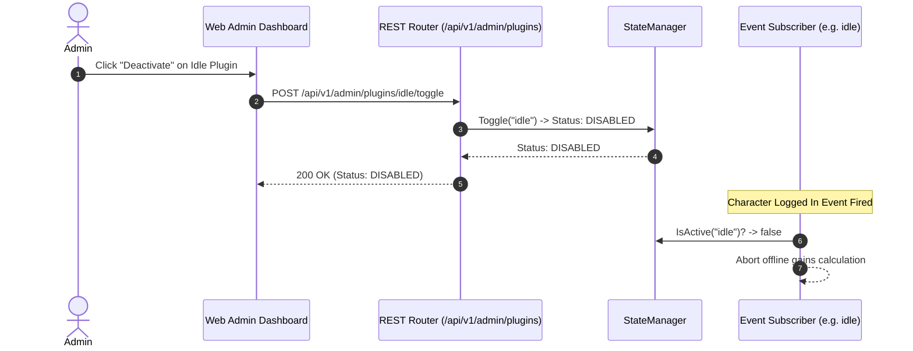

<!-- sha: f8a0141367af565bee288f8f7e7d34bf95cd961b -->
# 🧩 Plugin Subsystem & Extensibility

`zzrpg` follows a WordPress-style modular plugin architecture in Go. All game features (Auth, Character, Combat, Inventory, Items, Loot, Quests, Idle Gains) live as standalone packages under `backend/plugins/`.

## 1. Plugin Interface Contract

Every plugin implements `plugin.Plugin` ([backend/engine/plugin/plugin.go](file:///home/singo/github.com/singoesdeep/zzrpg/backend/engine/plugin/plugin.go#L28-L40)):

```go
type Plugin interface {
    Meta() Meta                 // Name & Requires dependencies
    Init(InitContext) error     // Services, routes, events, & hooks
    Start(RunContext) error     // Background goroutines (optional)
    Stop(context.Context) error // Teardown (optional)
}
```

## 2. Dynamic Admin View Extension (`AdminDescribor`)

Plugins optionally implement `plugin.AdminDescribor` ([backend/engine/plugin/plugin.go](file:///home/singo/github.com/singoesdeep/zzrpg/backend/engine/plugin/plugin.go#L100-L105)) to register UI metadata (Title, Description, Icon, Category, Endpoints) rendered in the Web Admin Dashboard (`/admin`):

```go
func (Plugin) AdminInfo() plugin.AdminInfo {
    return plugin.AdminInfo{
        Title:       "Idle Progression",
        Description: "Standalone event-driven offline progression plugin",
        Icon:        "fa-moon",
        Category:    "Economy",
        Endpoints:   []string{"EVENT: CharacterLoggedIn -> OfflineGainsGranted"},
    }
}
```

## 3. Runtime State Management (`StateManager`)

The `StateManager` ([backend/engine/plugin/plugin.go](file:///home/singo/github.com/singoesdeep/zzrpg/backend/engine/plugin/plugin.go#L108-L163)) allows administrators to activate or deactivate plugins dynamically via `POST /api/v1/admin/plugins/{name}/toggle` without restarting the server process.



## 4. Grounding & Code References

- Plugin Contract & StateManager: [plugin.go:L28-L163](file:///home/singo/github.com/singoesdeep/zzrpg/backend/engine/plugin/plugin.go#L28-L163)
- Standalone Plugin Packages: [backend/plugins/](file:///home/singo/github.com/singoesdeep/zzrpg/backend/plugins/)
- Plugin Author Guide: [docs/PLUGIN_GUIDE.md](file:///home/singo/github.com/singoesdeep/zzrpg/docs/PLUGIN_GUIDE.md)
